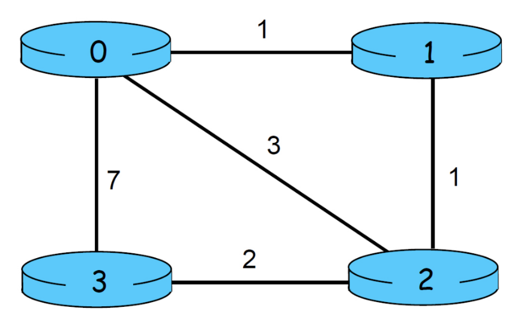
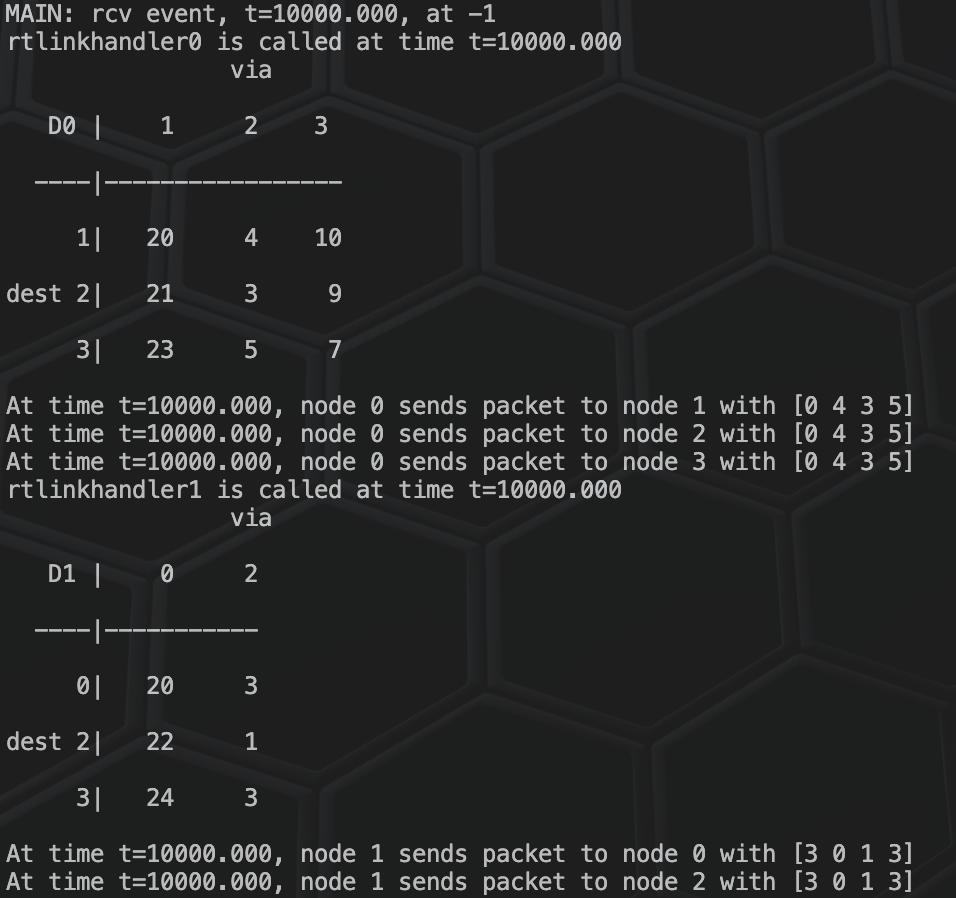
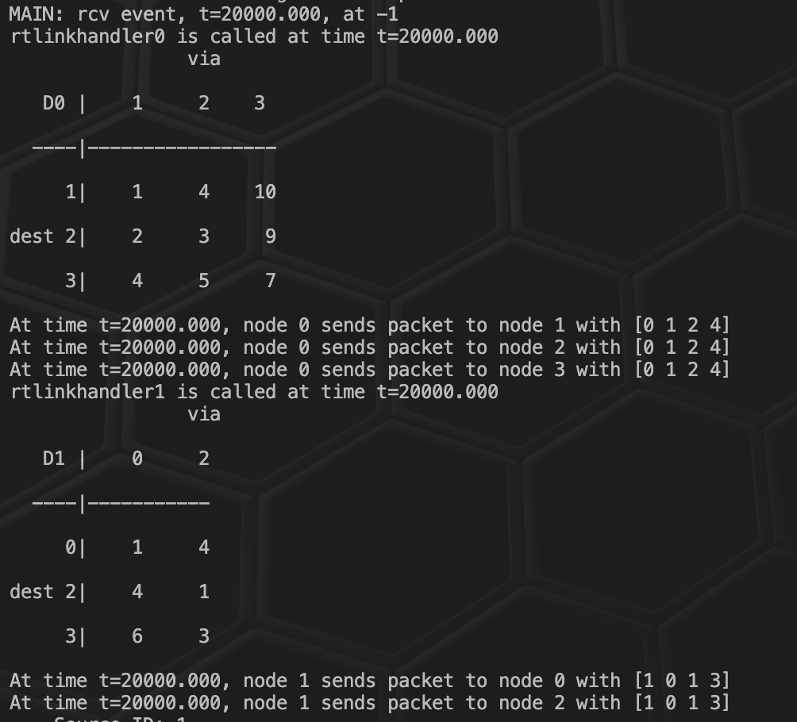

# Distributed Asynchronous Distance Vector Routing

Welcome to the repository for the Distributed Asynchronous Distance Vector Routing project. This project implements the Distance Vector Routing algorithm within an emulated network environment, highlighting how routers communicate and update their routing tables in response to changes in the network topology.

## 📊 Project Description

This project simulates a network where each node (router) uses distance vector routing to determine the shortest path to every other node in a distributed manner. It consists of implementing specific routines that handle the initialization and updating of routing tables based on the reception of new routing information and network changes.

## 🌐 Network Mesh

Here is a visual representation of the network mesh used in our simulations:

    

## 🔄 Router Link Handlers

### Router Linkhandler 0

This function handles changes in the link cost between router 0 and its directly connected neighbors.

    

### Router Linkhandler 1

This function manages updates for router 1 in response to changes in the network.

    

## 📝 Features

- **Initialization Routines**: Each router initializes its distance table reflecting direct link costs.
- **Update Routines**: Routers update their distance tables upon receiving new distance vectors from neighbors.
- **Link Cost Changes**: The system dynamically updates routing information in response to changes in link costs between routers.

## 📄 Sample Output

For a detailed view of the system's operations and state changes over time, refer to our [Sample Output PDF](Screenshots/SampleOutput.pdf). This document includes logs of function calls, distance table states, and the routing decisions made at various simulation times.

## 🔍 Conclusion

This project effectively demonstrates the functionality of distance vector routing in a simulated environment where routers asynchronously update their routing information based on network changes. It provides valuable insights into the complexities of network routing and the challenges of maintaining accurate routing information in dynamic network environments.